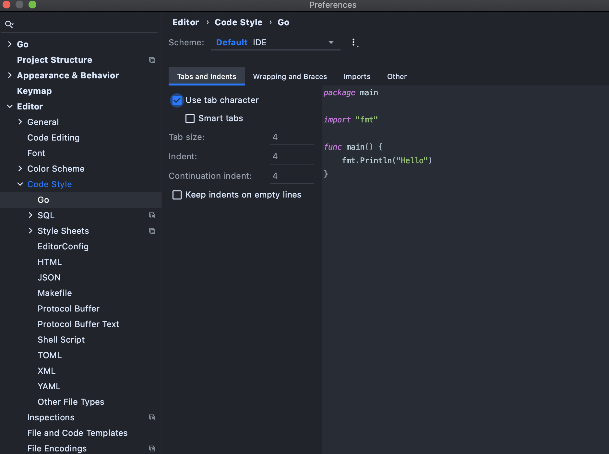

# Golang CI Linter Config

## Usage

### Basic

```shell
$ docker run \
    -v $(go env GOPATH):/go \
    -v $(pwd):/app \
    -w /app \
    --rm quay.io/mittwald/golangci-lint:latest \
        golangci-lint run -v ./...
```

### With config-merging

#### Mount additional config to pre-defined path

```shell
$ docker run \
    -v $(go env GOPATH):/go \
    -v $(pwd):/app \
    -w /app \
    -v /path/to/.golangci.yml:/.golangci.yml \
    --rm quay.io/mittwald/golangci-lint:latest \
        golangci-lint run -v ./...
```

#### Change pre-defined path to fit your needs

```shell
$ docker run \
    -v $(go env GOPATH):/go \
    -v $(pwd):/app \
    -w /app \
    -e GOLANGCI_ADDITIONAL_YML="/app/path/to/.golangci.yml" \
    --rm quay.io/mittwald/golangci-lint:latest \
        golangci-lint run -v ./...
```

## Recommended Goland Settings

* Settings > Tools > File Watcher: Add `go fmt`.

* Settings > Editor > Code Style > Go

    * Tabs and Indents

      

    * Wrapping and braces

      

    * Imports

      

    * Other: Activate `Add leading space to comments`

      